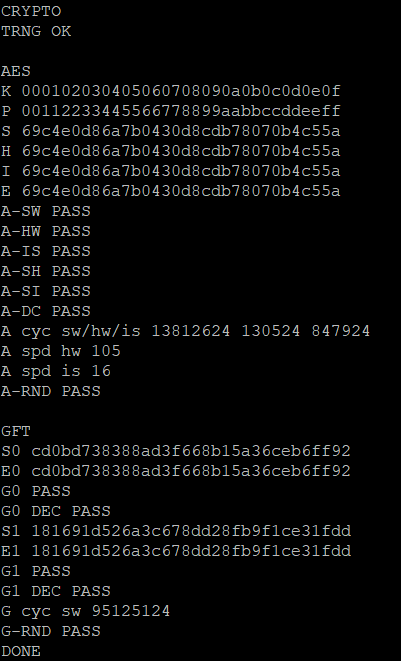

# 🔐 Task 2.2 – AES & GIFT on NEORV32


---

## 📌 Overview

This project implements and evaluates **AES-128** and **GIFT-128** cryptographic algorithms on the NEORV32 RISC-V processor.

Execution paths validated:

* Software (SW)
* Hardware acceleration via Custom Functions Subsystem (CFS)
* ISA-based acceleration (AES instructions)

The system is verified using known test vectors and benchmarked for performance improvements.

---

## ⚙️ Features

* AES-128 (SW, HW, ISA)
* GIFT-128 (SW encryption + decryption)
* TRNG validation
* Known test vector verification
* Randomized testing
* Cycle-based benchmarking

---

## 🗂️ Project Structure

```text
task_2_2/
├── README.md
├── docs/
│   ├── results/
│   └── screenshots/
├── hw/
│   └── rtl/
│       ├── core/
│       └── file_list_soc.f
└── sw/
    └── task2/
```

---

## 🧩 Hardware Setup

### 1. Copy Custom RTL Files

Copy:

```bash
task_2_2/hw/rtl/core/*.vhd
```

into:

```bash
<NEORV32>/rtl/core/
```

---

### 2. Update File List

Merge or replace:

```bash
task_2_2/hw/rtl/file_list_soc.f
```

into:

```bash
<NEORV32>/rtl/file_list_soc.f
```

Ensure all new VHDL files are included.

---

## 🧱 NEORV32 IP Packaging (Vivado)

After updating RTL, rebuild the NEORV32 IP:

```tcl
cd C:/neorv32/rtl/system_integration
source neorv32_vivado_ip.tcl
```

Verify it appears in Vivado IP Catalog under User Repository.

---

## 💻 Software Setup

Copy:

```bash
task_2_2/sw/task2/* → <NEORV32>/sw/example/task2/
```

Build:

```bash
cd <NEORV32>/sw/example/task2
make clean_all
make image
make install
```

---

## ⚠️ Makefile Notes

```make
NEORV32_HOME ?= /mnt/hgfs/neorv32
override CC = $(RISCV_PREFIX)g++
```

Update path if needed.

---

## 🔬 Validation

AES Test Vector:

```text
KEY: 000102030405060708090a0b0c0d0e0f
PT : 00112233445566778899aabbccddeeff
EXP: 69c4e0d86a7b0430d8cdb78070b4c55a
```

---

## 🖥️ Runtime Output



```
A-SW PASS
A-HW PASS
A-IS PASS
A-RND PASS

G0 PASS
G1 PASS

DONE
```

---

## 📊 Performance

```
AES cycles (SW/HW/ISA): 13812624 / 130524 / 847924
AES HW speedup: 105x
AES ISA speedup: 16x
```

---

## 🚀 Final Status

✔ Fully functional
✔ All tests passing
✔ Hardware acceleration verified
✔ Performance validated
